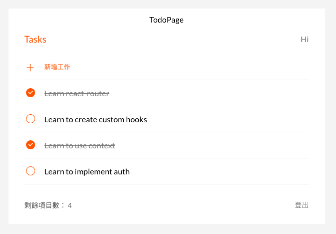

# Todo List X MVC with React

此專案目的為熟練操作 React 以及資料流的傳遞。
<br/>
<br/>

## 專案畫面



<br/>
<br/>

## 環境建置

- react: 18.2.0
- react-scripts: 4.0.3
- react-router-dom: 6.4.1
- This project was bootstrapped with [Create React App](https://github.com/facebook/create-react-app).

<br/>
<br/>

## Installing - 專案安裝流程

1. 打開終端機，下載此專案。

```
git clone https://github.com/JamieLoLo/todolist-react.git
```

2. 進入專案資料夾

```
cd todolist-react
```

3. 安裝套件

```
npm install
```

4. 啟動專案

```
npm start
```

5. TodoPage 網址位於

```
localhost:3000/todo
```

6. 退出專案可使用以下快捷鍵

```
control + C
```

</br>
</br>

## 專案開發人員

<a href="https://github.com/JamieLoLo">Jamie Lo</a>
